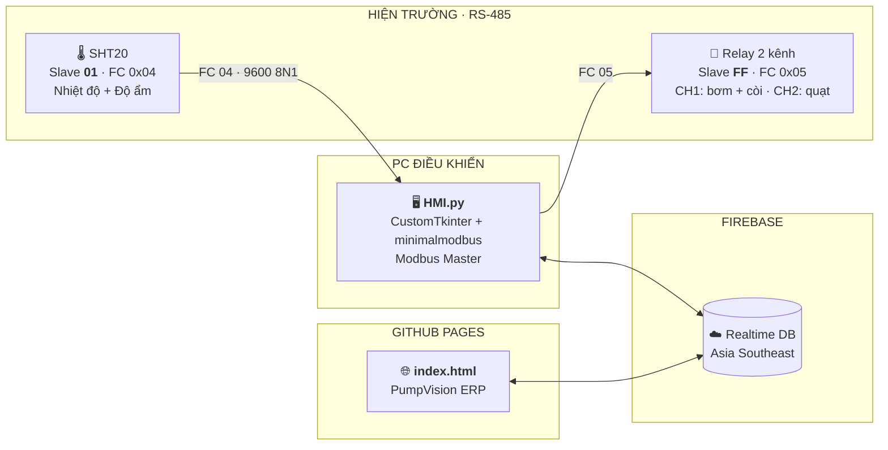

<div align="center">

# PumpVision

**SCADA/HMI + Web ERP — Giám sát môi trường, làm mát & dập lửa khẩn cấp**

**Modbus RTU RS-485 · Firebase Realtime Database · CustomTkinter · Vanilla JS**

[](HMI.py)


[](HMI.py)
[](https://venhladamz-star.github.io/kientrucmang/)

**🟢 Web ERP trực tiếp: <https://venhladamz-star.github.io/kientrucmang/>**

</div>

---

## 🎯 Tổng quan

Hệ thống gồm **hai ứng dụng** giao tiếp với nhau **duy nhất qua Firebase Realtime Database**
— không cần server trung gian, không cần `firebase-admin`:

| | Ứng dụng | Vai trò |
|---|---|---|
| 🖥 | **`HMI.py`** — SCADA/HMI desktop | **Source of truth về trạng thái.** Là Modbus Master duy nhất trên bus RS-485: đọc cảm biến, chạy logic điều khiển, ghi relay, thực thi lệnh từ cloud. |
| 🌐 | **`index.html`** — PumpVision Web ERP | **Source of truth về lệnh.** Chạy trên GitHub Pages: giám sát, cấu hình ngưỡng, gửi lệnh điều khiển từ xa, xem lịch sử & cảnh báo. |

> Triết lý thiết kế: **HMI quyết định trạng thái, ERP quyết định ý định.**
> Mọi lệnh đều đi `/control` → HMI kiểm tra hợp lệ → thực thi Modbus → trả `/control_ack`.
> Nếu mất mạng, HMI vẫn tự chạy được toàn bộ logic an toàn.

---

## 🏗 Kiến trúc



**Dòng dữ liệu chính:**

1. `HMI.py` đọc SHT20 (1 s/lần) → đẩy `/system_status` (1 s/lần) + `/history` (5 s/lần) · prune `/history` + `/alarms` bản >3 ngày mỗi 10 phút
2. ERP lắng nghe → render dashboard, biểu đồ, bảng lịch sử
3. Người vận hành bấm lệnh trên ERP → ghi `/control` kèm `command_sequence`
4. HMI poll `/control` (0,3 s) → kiểm tra hạn dùng & thứ tự → chạy Modbus → ghi `/control_ack`
5. ERP khớp `ack === seq` → báo **Đã xác nhận** (timeout 12 s)

---

## 🔌 Phần cứng & Modbus RTU

**Cổng serial:** `9600 · 8N1` · thời gian nghỉ giữa 2 frame ≥ **40 ms** · timeout 0,4 s

### Cảm biến SHT20

| Tham số | Giá trị |
|---|---|
| Slave ID | **1** |
| Hàm chức năng | **0x04** — Input Register |
| Nhiệt độ | thanh ghi **1** (`0x0001`) — đối chiếu kiểu 3xxxx: **30002** |
| Độ ẩm | thanh ghi **2** (`0x0002`) — đối chiếu kiểu 3xxxx: **30003** |
| Kiểu dữ liệu | 16-bit **có dấu**, giá trị thật = `raw / 10` |

> Đọc lệch 1 thanh ghi? Đổi hằng `SHT20_REG_START` giữa `0x0001` ↔ `0x0000`.

### Bảng relay 2 kênh

| Kênh | Coil | Tải | Ghi ON |
|---|---|---|---|
| **CH1** | `0x0000` | **Máy bơm MB370 + Còi báo** (mắc song song) | `0xFF00` |
| **CH2** | `0x0001` | **Quạt tản nhiệt 12V** | `0xFF00` |

| Tham số | Giá trị |
|---|---|
| Slave ID | **255** (`0xFF`) — *Địa chỉ chuẩn Modbus là 1–247; 255 là địa chỉ dành riêng (reserved), đã kiểm tra `minimalmodbus` vẫn chấp nhận* |
| Hàm chức năng | **0x05** — Write Single Coil |

> Board của bạn đánh coil bắt đầu từ **1**? Sửa **một dòng**: `COIL_CH1, COIL_CH2 = 1, 2`

---

## 🧠 Logic điều khiển

### Hysteresis (không bật/tắt chập chờn)

| Cơ cấu | BẬT khi | TẮT khi | Mặc định |
|---|---|---|---|
| 🌀 Quạt | `T ≥ FAN_ON` | `T ≤ FAN_OFF` | **32.0 / 30.0 °C** |
| 🚒 Bơm + còi | `T ≥ PUMP_ON` | `T ≤ PUMP_OFF` | **50.0 / 42.0 °C** |

Ngưỡng được **chỉnh sống từ ERP** (tab *Cài đặt*), có ràng buộc:

- `OFF < ON` từng cặp
- **Quạt phải làm mát TRƯỚC** khi bơm phun nước: `FAN_ON ≤ PUMP_ON` và `FAN_OFF ≤ PUMP_OFF`
- HMI từ chối cấu hình sai → ghi đè lại `/settings` bằng bộ ngưỡng **đang chạy** → ERP tự khôi phục input
- Ngưỡng được lưu kèm vào `hmi_state.json` khi thay đổi và nạp lại khi khởi động → boot lúc mất mạng vẫn chạy đúng ngưỡng (không rơi về default 32/30/50/42)

### An toàn

| Tính năng | Hành vi |
|---|---|
| **Failsafe** | Mất dữ liệu cảm biến **1 chu kỳ** → cưỡng bức ngắt bơm ngay, log & báo `COMM_LOSS` **đúng 1 lần** (không spam) |
| **E-STOP** | Khi khóa: cả 2 tải OFF và **không ghi Modbus thừa** ở chu kỳ sau; chỉ ghi khi tải còn đang ON |
| **Mất cổng COM** | Tự nhận diện, tắt tải an toàn, thử mở lại mỗi **3 s**; nhãn chuyển `● LINK LOST` |
| **Quy tắc ngưỡng** | `max_timeouts` bị khóa ở **1** — không cho nới lỏng failsafe từ cloud |
| **Chống replay** | Lệnh cũ hơn 30 s hoặc có `issued_at_ms` trước khi HMI khởi động → `REJECTED` |
| **Chống lệch giờ** | Máy HMI và trình duyệt cho phép lệch tới **30 s** (NTP) |
| **⚠️ E-STOP là phần mềm** | Nút ⛔ gửi lệnh qua cloud → HMI ghi coil Modbus. **Mất mạng / tắt HMI là không kích hoạt được** — muốn an toàn thật phải có nút nhấn vật lý (NC) trên mạch điện, không dựa vào phần mềm |

### Chế độ vận hành

- **AUTO** — HMI tự quyết định theo hysteresis
- **MANUAL** — người vận hành bật/tắt từng cơ cấu (qua nút trên HMI hoặc ERP)
- Khi đang **Polling**, HMI chặn đổi sang **Simulation** để không tráo nguồn dữ liệu

---

## 💻 HMI máy tính để bàn

**`HMI.py`** — một file duy nhất, không cần server.

```bash
pip install customtkinter minimalmodbus pyserial requests
python HMI.py
```

- Ô **COM** tự quét lại mỗi **3 giây** cho tới khi tìm thấy adapter USB–RS485
- Nếu thiếu thư viện, app **báo đúng nguyên nhân** thay vì để dropdown trống im lặng
- Sơ đồ hiện trường vẽ trực tiếp trên `Canvas`: SHT20 · Relay · Quạt · Bơm — LED theo trạng thái thật
- Ô log có phân loại màu (`MB` / `FB` / `ERR` / `OK`), tự cắt ở 500 dòng
- Chế độ **Simulation** cho phép chạy demo không cần phần cứng

---

## 🌐 Web ERP

**`index.html`** — một file HTML, chạy nguyên bản trên GitHub Pages (không build, không framework).

**Mở trực tiếp: <https://venhladamz-star.github.io/kientrucmang/>**

| Tab | Nội dung |
|---|---|
| **System Overview** | KPI nhiệt độ/độ ẩm, công tắc AUTO·MANUAL, nút quạt/bơm, **⛔ E-STOP** |
| **Giám sát** | Biểu đồ nhiệt độ – độ ẩm theo thời gian thực |
| **Cảnh báo** | Danh sách alarm, lọc theo loại/mức độ/tìm kiếm, đếm chưa đọc |
| **Thiết bị** | Thông số từng thiết bị Modbus, ngưỡng đang chạy, trạng thái kênh relay |
| **Báo cáo** | Bảng lịch sử chi tiết, xuất CSV |
| **Cài đặt** | Sửa ngưỡng hysteresis rồi đồng bộ về HMI |

**Điểm nhấn kỹ thuật:**

- 🔐 Web **không cần đăng nhập** — mở link là vào; HMI (desktop) vẫn đăng nhập Email/Password vì REST API cần token
- 🔁 Lắng nghe lịch sử bằng `child_added / child_changed / child_removed` thay vì
  `value + limitToLast(300)` → mỗi chu kỳ chỉ tải **~400 B**, không tải lại 90 KB mỗi 5 giây
- ⏱ **Cảnh báo ACK sau 12 s** nếu HMI không phản hồi, kèm gợi ý chẩn đoán
- 🛡 Mọi dữ liệu từ cloud đều qua `escapeHTML()` / `num()` trước khi nhúng vào DOM (chống XSS)
- 📱 Responsive, có menu trượt trên mobile
- 🧩 Bảng **Cảnh báo** render lại toàn bộ (~200 phần tử) mỗi khi có alarm đổi — perf NIT, chấp nhận được ở quy mô này, chưa tối ưu (đợt 4 xác nhận bỏ qua)

---

## ☁️ Hợp đồng Firebase

Cả hai ứng dụng **chỉ** giao tiếp qua các node sau — đổi tên node là hỏng liên thông.

| Node | HMI | ERP | Cấu trúc trường |
|---|---|---|---|
| `/system_status` | ghi 1 s | `on('value')` | `temperature, humidity, fan_state, pump_state, mode, comm_ok, failsafe, emergency_lock, heartbeat, last_command_sequence, last_command_result, timestamp` |
| `/history/{ms}` | ghi 5 s | `child_added/changed/removed` | giống `system_status`, key = mili-giây; prune bản >3 ngày (10 phút/lượt) |
| `/alarms/{id}` | `push` | `value · limitToLast(200); prune bản >3 ngày` | `type, message, temperature, timestamp, alarm_id` |
| `/control` | **đọc** 0,3 s | **`transaction()`** | `command_sequence, mode_cmd, fan_cmd, pump_cmd, emergency_cmd, clear_emergency, issued_at, issued_at_ms, issued_by, client_id` |
| `/control_ack` | **ghi** | `value` + khớp `seq` + `client_id` | `command_sequence, accepted, result, message, mode, fan_state, pump_state, emergency_lock, timestamp, client_id` |
| `/control_acks/{seq}` | **ghi** (song song với `/control_ack`) | `watchAck` theo seq đang chờ | giống `/control_ack` — mỗi seq 1 key riêng, client khác gửi lệnh không ghi đè mất ACK |
| `/settings` | đọc 3 s | `set()` + `value` | `fan_on, fan_off, pump_on, pump_off, max_timeouts` |

**Mã cảnh báo:** `FIRE` · `COMM_LOSS` · `EMERGENCY` · `FAN_ACTUATOR_FAIL` · `PUMP_ACTUATOR_FAIL` · `ESTOP_RELAY_FAIL`

**Kết quả lệnh:** `PENDING` · `ACCEPTED` · `REJECTED`

> ⚠️ **`/control` là 1 slot, không phải hàng đợi**: `transaction()` chỉ chặn ghi đè khi còn
> lệnh chờ ACK (< 30 s) — gửi liên tiếp thì lệnh đến sau phải chờ lệnh trước được ACK
> hoặc hết hạn. Cần lệnh mới ngay: chờ ACK rồi gửi tiếp.

---

## 🚀 Cài đặt & Triển khai

### 1. Firebase (một lần duy nhất)

```text
Console → Authentication → Sign-in method → Bật "Email/Password"   ← cho HMI (desktop)
Console → Realtime Database → chọn vùng, rồi đặt Rules:
```

```json
{
  "rules": {
    ".read":  true,
    ".write": true
  }
}
```

> ℹ️ **Rules PHẢI mở** vì web không đăng nhập. Hệ quả: *bất kỳ ai* có URL đều ghi được
> `/control` và **điều khiển được máy bơm + còi từ xa**. Đây là đánh đổi đã chọn để
> không cần tài khoản (project lớp học). Muốn chặn lại: bật `"auth != null"` trở lại
> **và** cho web đăng nhập (Anonymous Auth là cách nhẹ nhất — không cần email/mật khẩu).
>
> ⚠️ **Rules là cấu hình trên Firebase Console, code không tự đặt được** — trước khi
> vận hành thật, hãy tự mở Console kiểm tra lại Rules (dự án này để `.read/.write: true`).
>
> Đồng hồ hai máy cần lệch **< 30 s** (NTP) để lệnh không bị từ chối oan.

### 2. HMI

```bash
git clone https://github.com/venhladamz-star/kientrucmang.git
cd kientrucmang
pip install customtkinter minimalmodbus pyserial requests
python HMI.py
```

Cắm adapter USB–RS485 → chọn cổng COM → **KẾT NỐI** (hoặc bật *Simulation* để demo).

### 3. Web ERP

Mở <https://venhladamz-star.github.io/kientrucmang/> là vào — **không cần đăng nhập**.
Muốn tự host: bật **GitHub Pages → Deploy from branch → main / root**, file `index.html`
chính là trang chủ.

---

## ⚙️ Bảng cấu hình (`class Config`)

| Hằng | Mặc định | Ý nghĩa |
|---|---|---|
| `BAUDRATE / BYTESIZE / PARITY / STOPBITS` | `9600 / 8 / N / 1` | Cấu hình serial RS-485 |
| `SLAVE_SHT20` | `1` | Địa chỉ slave cảm biến |
| `SLAVE_RELAY` | `255` | Địa chỉ slave bảng relay |
| `SHT20_REG_START` | `0x0001` | Thanh ghi nhiệt độ (độ ẩm = +1) |
| `COIL_CH1 / COIL_CH2` | `0x0000 / 0x0001` | Kênh bơm+còi / kênh quạt |
| `INTER_FRAME_DELAY` | `0.040` | Nghỉ giữa 2 frame Modbus (s) |
| `POLL_INTERVAL` | `1.0` | Chu kỳ đọc cảm biến (s) |
| `FAN_ON / FAN_OFF` | `32.0 / 30.0` | Ngưỡng hysteresis quạt (°C) |
| `PUMP_ON / PUMP_OFF` | `50.0 / 42.0` | Ngưỡng hysteresis bơm (°C) |
| `MAX_TIMEOUTS` | `1` | Chu kỳ mất dữ liệu trước khi failsafe — **bị khóa** |
| `FB_PUSH_SEC / HISTORY_PUSH_SEC` | `5.0` | Chu kỳ đẩy `/history` (s); `/system_status` dùng `POLL_INTERVAL` = 1 s |
| `CONTROL_POLL_SEC` | `0.3` | Chu kỳ poll `/control` (s) |
| `SETTINGS_POLL_SEC` | `3.0` | Chu kỳ poll `/settings` (s) |
| `CONTROL_MAX_AGE_SEC` | `30.0` | Lệnh cũ hơn bị bỏ (chống replay) |
| `CLOCK_SKEW_TOL_MS` | `30000` | Dung sai lệch giờ HMI ↔ trình duyệt |
| `REOPEN_SEC` | `3.0` | Thử mở lại cổng COM sau khi mất |

---

## 🔒 Bảo mật — đọc trước khi up GitHub

Dự án này **điều khiển cơ cấu vật lý thật**, nên hãy soát lại trước khi đặt repo **public**:

- [ ] **`FIREBASE_API_KEY`, `FIREBASE_DB_URL`, tài khoản demo** đang hardcode trong
      `HMI.py` (web **đã bỏ đăng nhập**, không còn password ở `index.html`).
      API key của Firebase Web API vốn không phải secret, nhưng **password demo thì có**.
- [ ] ⚠️ Rules **phải là `".read": true, ".write": true`** vì web không đăng nhập —
      đọc thêm cảnh báo ở mục *Cài đặt & Triển khai → Firebase*. Muốn siết lại thì bật
      `"auth != null"` **và** cho web đăng nhập (Anonymous Auth).
- [ ] Nếu fork dự án: **thay `FIREBASE_DB_URL`** sang project của bạn, nếu không
      hai Instance sẽ ghi chung vào một database.
- [ ] Đặt lại `DEMO_EMAIL` / `DEMO_PASSWORD` trong `HMI.py` trước khi công khai.

---

## 📁 Cấu trúc dự án

```text
kientrucmang/
├── HMI.py          # SCADA/HMI desktop — Modbus Master + Firebase bridge
├── index.html      # PumpVision Web ERP — chạy nguyên bản trên GitHub Pages
└── README.md
```

> Dự án cố ý **không dùng thư viện build**: Python chạy được ngay, HTML mở được ngay.
> Ít phụ thuộc = ít thứ hỏng khi đổi máy.

---

## 🧰 Công nghệ

| Tầng | Thành phần |
|---|---|
| Ngôn ngữ | Python 3 · JavaScript (ES5 tương thích cũ) |
| Giao diện desktop | [CustomTkinter](https://github.com/TomSchimansky/CustomTkinter) |
| Giao thức công nghiệp | Modbus RTU qua [minimalmodbus](https://github.com/pyhys/minimalmodbus) + [pyserial](https://github.com/pyserial/pyserial) |
| Giao diện web | HTML/CSS/JS thuần — không framework, không bundler |
| Cloud | Firebase Realtime Database · Firebase Auth · SDK compat `9.23.0` |
| API HTTP | `requests` (HMI dùng REST, **không cần** `firebase-admin`) |
| Hosting | GitHub Pages |

---

<div align="center">

**PumpVision** — *giám sát bằng dữ liệu, an toàn bằng logic.*

[](https://venhladamz-star.github.io/kientrucmang/)

</div>
